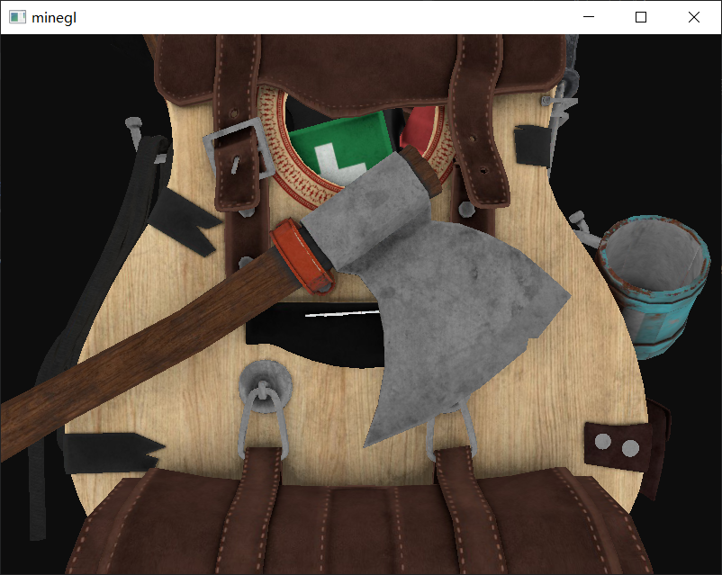

# 模型加载器
本项目旨在学习使用assimp库以下内容
1. 模型加载
2. 骨骼动画

本项目使用vcpkg管理依赖，使用前安装以下依赖

```bash
vcpkg install glad:x64-windows
vcpkg install glfw3:x64-windows
vcpkg install assimp:x64-windows
vcpkg install glm:x64-windows
vcpkg install stb


```

运行效果
